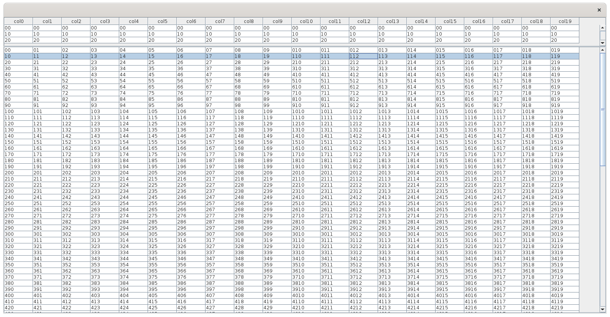

# Frozen Row Table

## Description
A table that shows several rows as an always visible colum header

## Screenshots



## Execution

Example provides a main class for jar and mvn exec so you can run either with:

```
mvn exec:java
```

or

```
mvn package
java -jar target/*.jar
```

## Credits

Based on original example from http://www.java2s.com/Code/Java/Swing-Components/FixedTableRowExample.htm
